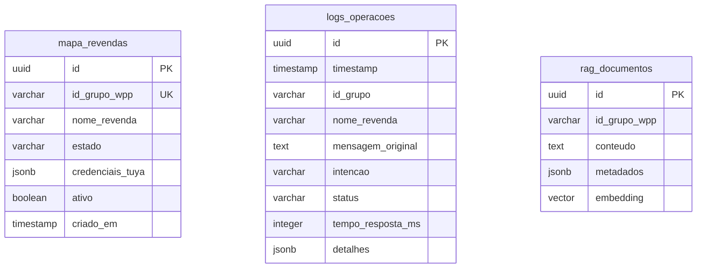
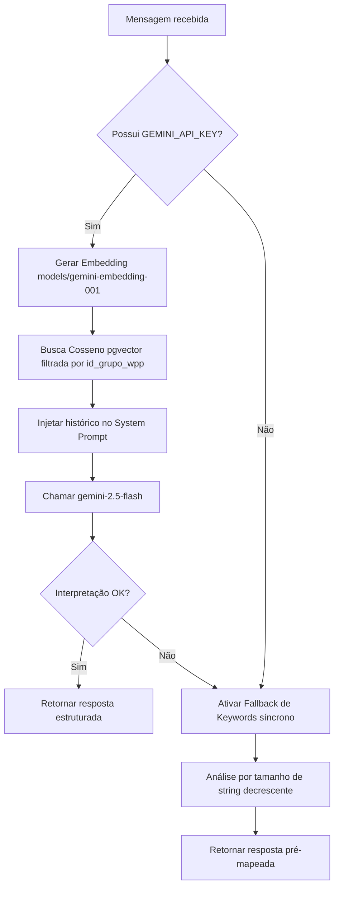

# 🤖 Agente SOF — API IoT WhatsApp & RAG

<p align="center">
  
  
  
  
  
</p>

O **Agente SOF** é uma API moderna baseada em **FastAPI** que atua como uma ponte inteligente (Bridge Multi-tenant) para controle de dispositivos de climatização IoT via WhatsApp e n8n.

Ela integra modelos de linguagem do **Google Gemini** enriquecidos com recuperação de histórico de conversas (**RAG**) e banco de dados **PostgreSQL** com suporte à busca vetorial (**pgvector**).

---

## 📖 1. Visão Geral e Propósito do Projeto

O objetivo principal desta API é traduzir mensagens de texto livre enviadas por usuários em grupos de WhatsApp (ex: *"tá muito quente aqui, ajuda!"* ou *"pode desligar as máquinas"*) em **comandos estruturados** que acionam os aparelhos físicos de climatização.

### 🔄 Fluxo Completo de Comunicação (Ponta a Ponta)

```
[ Usuário ] 💬 "Tá calor aqui!"
    │
    ▼
[ WhatsApp ] 📱 
    │
    ▼
[ Z-API Gateway ] 🔌
    │
    ▼
[ n8n Orquestrador ] ⚙️
    │
    ├──► (POST /agent) ──► [ Agente SOF (Esta API) ] 🤖 (FastAPI)
    │                           │
    │                           ├──► [ PostgreSQL (pgvector) ] 🗄️ (Busca RAG)
    │                           ├──► [ Gemini 2.5 Flash ] 🧠 (Classifica a Intenção)
    │                           └─── (Retorna JSON com Link IFTTT e Mensagem WPP)
    │
    ◄────────────────── (Retorno) ───┘
    │
    ├──► [ Webhook IFTTT ] 🌐
    │         │
    │         ▼
    │    [ Tuya Smart Life ] ❄️ (Liga o Ar-Condicionado)
    │
    ▼
[ Confirmação WhatsApp ] 🤖 "Entendido! Ativando modo resfriamento... ❄️"
```

### 🧠 O Papel da API no Ecossistema (O que ela faz na prática?)

A API atua como o **cérebro** da automação, resolvendo cinco grandes necessidades do sistema:

1. **Centralização da Inteligência:** Em vez de programar regras complexas de interpretação de mensagens (como código JavaScript e expressões regulares Regex) diretamente dentro de nós do n8n, a inteligência reside na API. Isso simplifica a manutenção e permite testes locais e automatizados em Python.
2. **Abstração Multi-tenant (Isolamento de Dados):** O sistema gerencia o showroom de múltiplos clientes (multi-tenant). A API recebe apenas o ID do grupo do WhatsApp e pesquisa no banco de dados para recuperar as credenciais de controle e links correspondentes àquela revenda específica, garantindo que o comando de um grupo nunca afete o ambiente de outro.
3. **Memória Contextual com RAG:** Integrada ao banco PostgreSQL, a API gera embeddings da mensagem e busca no histórico vetorial (`rag_documentos`) conversas passadas da revenda. A IA do Gemini utiliza este histórico para interpretar comandos implícitos, oferecendo respostas mais humanas e contextualizadas.
4. **Desacoplamento de Integração (IFTTT para Tuya Direto):** Atualmente (Fase 1), a API funciona como ponte que busca e retorna links do IFTTT para o n8n executar. Na Fase 2 (integração direta com a API Tuya), a API gerenciará os dispositivos nativamente, e essa transição ocorrerá sem a necessidade de reescrever fluxos de trabalho no n8n.
5. **Auditoria e Monitoramento de Latência:** Todas as chamadas, intenções identificadas e tempos de resposta em milissegundos são gravados na tabela `logs_operacoes`, gerando métricas de performance e relatórios detalhados de auditoria.

---

## 📂 2. Estrutura do Projeto

O projeto é estruturado de forma modular e escalável:

```text
agente-sof/
├── app/                        # 🐍 Código-fonte principal da API
│   ├── main.py                 # 🚀 Ponto de entrada, rotas e fallback
│   ├── config.py               # ⚙️ Validação estrita do arquivo .env (Pydantic)
│   ├── database.py             # 🗄️ Conectividade e pool assíncrono (SQLAlchemy)
│   ├── schemas/                # 📝 Contratos de dados e validações (Pydantic)
│   │   └── agent.py            #    Schemas de Request, Response e Error
│   └── services/               # 🧠 Regras de negócio e integrações
│       ├── llm_service.py      #    Classificação e chat inteligente via Gemini
│       └── rag_service.py      #    Busca vetorial de contexto no banco de dados
├── database/                   # 🛢️ Scripts e definições de banco de dados
│   ├── init.sql                #    DDL de tabelas, extensões e índices
│   ├── seed_teste.sql          #    Massa de dados exclusiva para Grupo de Teste
│   └── seed_grupos.sql         #    Dados oficiais de homologação e produção
├── tests/                      # 🧪 Suíte de validação automatizada
│   └── test_grupo_thiago.py    #    Script de simulação em lote de chamadas
├── docker-compose.yml          # 🐳 Orquestração do banco, API e proxy reverso Caddy
├── requirements.txt            # 📦 Dependências do ecossistema Python
└── cloudflared.exe             # 🌐 Executável auxiliar do Cloudflare Tunnel
```

---

## 🔌 3. Detalhes Técnicos dos Endpoints

A API possui documentação automática e interativa do **Swagger UI** disponível em `/docs`.

### 🟢 A. `GET /health`
*   **Descrição:** Liveness probe para verificação de saúde da aplicação.
*   **Response Exemplo (HTTP 200):**
    ```json
    {
      "status": "ok",
      "version": "0.1.0",
      "environment": "development",
      "mode": "ifttt_bridge"
    }
    ```

### 🔵 B. `POST /agent`
*   **Descrição:** Analisa a mensagem do usuário no WhatsApp e define a ação correspondente.
*   **Tratamento de Validação:** Erros nos tipos de parâmetros resultam em um retorno **HTTP 422 Unprocessable Entity**.

#### 📥 Payload de Entrada (`AgentRequest`)
| Campo | Tipo | Obrigatório | Descrição |
| :--- | :--- | :---: | :--- |
| `mensagem` | `str` | **Sim** | Texto literal digitado pelo usuário (1 a 4096 caracteres). |
| `id_grupo` | `str` | **Sim** | ID único do grupo do WhatsApp (`XXXXXXXXXXX@g.us`). |
| `nome_revenda` | `str` | **Sim** | Identificador textual da revenda. |

*Exemplo de Request:*
```json
{
  "mensagem": "pode esfriar a sala por favor, tá abafado",
  "id_grupo": "120363422455765261-group",
  "nome_revenda": "Grupo Thiago (Teste)"
}
```

#### 📤 Payload de Retorno (`AgentResponse`)
| Campo | Tipo | Descrição |
| :--- | :--- | :--- |
| `intencao` | `str` | Categoria identificada (`ligar_resfriamento` \| `ligar_aquecimento` \| `desligar_dispositivos` \| `ligar_dispositivos` \| `sem_acao`). |
| `dispositivo_id` | `str` \| `null` | Reservado para identificação do dispositivo Tuya físico (Fase 2). |
| `ifttt_action` | `str` \| `null` | Ação física IoT detectada (`freezer` \| `esquentar` \| `off` \| `ligar`). |
| `link_ifttt` | `str` \| `null` | URL do webhook a ser disparada pelo n8n (buscada do banco de dados). |
| `parametros` | `dict` | Parâmetros extras passados ao comando. |
| `mensagem_wpp` | `str` | Resposta amigável gerada com emojis para envio ao cliente. |

*Exemplo de Response:*
```json
{
  "intencao": "ligar_resfriamento",
  "dispositivo_id": null,
  "ifttt_action": "freezer",
  "link_ifttt": "https://maker.ifttt.com/trigger/Teste_ligar/with/key/boVO_...",
  "parametros": {},
  "mensagem_wpp": "Entendido! ❄️ Ativando modo resfriamento. Aguarde alguns instantes."
}
```

#### 🔴 Resposta de Erro Inesperado (HTTP 500)
```json
{
  "error": "internal_server_error",
  "message": "Erro interno ao processar o comando. Tente novamente."
}
```
> [!WARNING]
> Erros HTTP 500 geram um registro automático na tabela de logs com status `"erro"` contendo a stack trace para facilitar a depuração.

---

## 🗄️ 4. Esquema de Banco de Dados (PostgreSQL)

O banco é criado com suporte a UUID v4 e busca semântica vetorial através das extensões `pgcrypto` e `vector`.



*   **Busca Vetorial Rápida:** A tabela `rag_documentos` utiliza um índice especial **HNSW** (`vector_cosine_ops`) no campo `embedding` para computar a similaridade de cosseno de forma ultra rápida.

---

## 🧠 5. Pipeline Híbrido: Gemini 2.5 Flash + Fallback



> [!IMPORTANT]
> **Por que a ordenação decrescente de Keywords importa?**
> Ao aplicar o fallback de palavras-chave, a frase *"muito frio"* deve acionar aquecimento (`esquentar`) e não resfriamento (`freezer`) por conter a substring *"frio"*. Ordenando o match pelo comprimento da string de maior para menor, evitamos falsos positivos.

---

## ⚙️ 6. Guia Didático de Inicialização (Passo a Passo)

### 💻 Método A: Execução Nativa (venv)
Ideal para desenvolvimento ágil com suporte a recarga automática (*Hot-Reload*).

1. **Acesse o Terminal no diretório raiz:**
   ```powershell
   cd "c:\Users\SOF - Jaylson\Desktop\sof-ia-v1\agente-sof"
   ```
2. **Crie e Ative o seu Ambiente Virtual:**
   ```powershell
   python -m venv venv
   .\venv\Scripts\Activate.ps1
   ```
3. **Instale as Dependências Python:**
   ```powershell
   pip install -r requirements.txt
   ```
4. **Configure seu arquivo de ambiente:**
   Copie `.env.example` para `.env` e preencha as variáveis de ambiente necessárias.
5. **Suba apenas o serviço do banco local:**
   ```powershell
   docker compose up -d db
   ```
6. **Popule a massa de testes (Seeding):**
   ```powershell
   Get-Content database/seed_teste.sql | docker exec -i agente_sof_db psql -U agente_user -d agente_sof_db
   ```
7. **Execute o Uvicorn Server:**
   ```powershell
   uvicorn app.main:app --reload --port 8000
   ```

---

### 🐳 Método B: Execução em Docker Completo
Simula o comportamento real de produção (incluindo o proxy reverso Caddy).

1. **Suba a infraestrutura completa:**
   ```powershell
   docker compose up -d --build
   ```
2. **Importe os dados de teste:**
   ```powershell
   Get-Content database/seed_teste.sql | docker exec -i agente_sof_db psql -U agente_user -d agente_sof_db
   ```

---

## 🧪 7. Execução dos Testes Locais

Para testar a inteligência de classificação da API localmente em lote:
1. Deixe o servidor rodando em `http://127.0.0.1:8000`.
2. Abra outro terminal e execute:
   ```powershell
   python tests/test_grupo_thiago.py
   ```
3. O console imprimirá um relatório visual do comportamento semântico para 17 mensagens críticas de teste.

---

## 🌐 8. Exposição Pública para Webhooks (Cloudflare Tunnel)

Para receber requisições em tempo real do n8n na nuvem sem precisar abrir portas do roteador:
1. Inicie a API FastAPI na porta `8000`.
2. Abra um terminal e digite:
   ```powershell
   .\cloudflared.exe tunnel --url http://localhost:8000
   ```
3. Copie o endereço gerado (ex: `https://xxxx.trycloudflare.com`).
4. A URL de webhook configurável no n8n será:
   `https://xxxx.trycloudflare.com/agent`

---

## ☁️ 9. Deploy Seguro em Produção (VPS)

1. **Apontamento de DNS:** Configure um registro do tipo **A** (ex: `api.seudominio.com`) para o IP da sua VPS.
2. **Compacte o projeto local:** Crie um ZIP da pasta `agente-sof` **excluindo a pasta `venv`**.
3. **Envie à VPS:**
   ```powershell
   scp "c:\Users\SOF - Jaylson\Desktop\sof-ia-v1\agente-sof.zip" usuario@IP_DA_VPS:/home/usuario/
   ```
4. **Instale e descompacte na VPS:**
   ```bash
   ssh usuario@IP_DA_VPS
   sudo apt update && sudo apt install docker.io docker-compose-v2 unzip -y
   unzip agente-sof.zip -d agente-sof
   cd agente-sof
   ```
5. **Ajuste o `.env` de Produção:**
   ```bash
   cp .env.example .env
   nano .env
   ```
   *Certifique-se que `DATABASE_URL` aponta para o host `db` do compose: `postgresql+asyncpg://agente_user:SENHA@db:5432/agente_sof_db`*.
6. **Inicie os containers e aplique a carga oficial:**
   ```bash
   docker compose up -d --build
   docker exec -i agente_sof_db psql -U agente_user -d agente_sof_db < database/seed_grupos.sql
   ```

> [!TIP]
> **Acesso via IP Público vs Caddy:** Se você estiver utilizando acesso direto via IP público (`http://IP_DA_VPS:8000`), a porta `"8000:8000"` no `docker-compose.yml` deve permanecer liberada. Quando você configurar um domínio com o **Caddy** (HTTPS), recomendamos alterar a porta para `"127.0.0.1:8000:8000"` para que todo o tráfego passe obrigatoriamente pelo proxy seguro nas portas 80/443.


