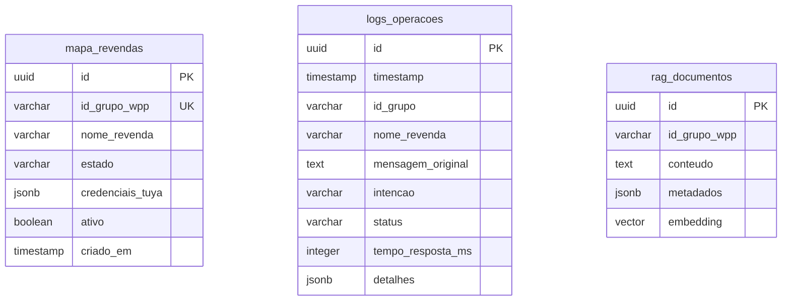
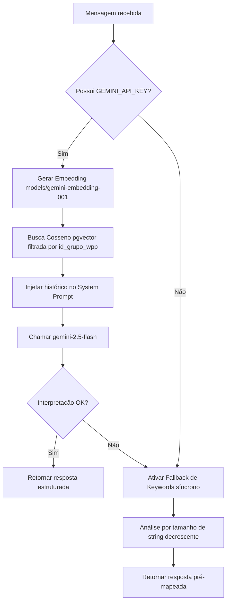

# 🤖 Agente SOF — API IoT WhatsApp & RAG

<p align="center">
  
  
  
  
  
</p>

O **Agente SOF** é uma API moderna baseada em **FastAPI** que atua como uma ponte inteligente (Bridge Multi-tenant) para controle de dispositivos de climatização IoT via WhatsApp e n8n.

Ela integra modelos de linguagem do **Google Gemini** enriquecidos com recuperação de histórico de conversas (**RAG**) e banco de dados **PostgreSQL** com suporte à busca vetorial (**pgvector**).

---

## 📖 1. Visão Geral e Propósito do Projeto

O objetivo principal desta API é traduzir mensagens de texto livre enviadas por usuários em grupos de WhatsApp (ex: *"tá muito quente aqui, ajuda!"* ou *"pode desligar as máquinas"*) em **comandos estruturados** que acionam os aparelhos físicos de climatização.

### 🔄 Fluxo Completo de Comunicação (Ponta a Ponta)

```
[ Usuário ] 💬 "Tá calor aqui!"
    │
    ▼
[ WhatsApp ] 📱 
    │
    ▼
[ Z-API Gateway ] 🔌
    │
    ▼
[ n8n Orquestrador ] ⚙️
    │
    ├──► (POST /agent) ──► [ Agente SOF (Esta API) ] 🤖 (FastAPI)
    │                           │
    │                           ├──► [ PostgreSQL (pgvector) ] 🗄️ (Busca RAG)
    │                           ├──► [ Gemini 2.5 Flash ] 🧠 (Classifica a Intenção)
    │                           └─── (Retorna JSON com Link IFTTT e Mensagem WPP)
    │
    ◄────────────────── (Retorno) ───┘
    │
    ├──► [ Webhook IFTTT ] 🌐
    │         │
    │         ▼
    │    [ Tuya Smart Life ] ❄️ (Liga o Ar-Condicionado)
    │
    ▼
[ Confirmação WhatsApp ] 🤖 "Entendido! Ativando modo resfriamento... ❄️"
```

### 🧠 O Papel da API no Ecossistema (O que ela faz na prática?)

A API atua como o **cérebro** da automação, resolvendo cinco grandes necessidades do sistema:

1. **Centralização da Inteligência:** Em vez de programar regras complexas de interpretação de mensagens (como código JavaScript e expressões regulares Regex) diretamente dentro de nós do n8n, a inteligência reside na API. Isso simplifica a manutenção e permite testes locais e automatizados em Python.
2. **Abstração Multi-tenant (Isolamento de Dados):** O sistema gerencia o showroom de múltiplos clientes (multi-tenant). A API recebe apenas o ID do grupo do WhatsApp e pesquisa no banco de dados para recuperar as credenciais de controle e links correspondentes àquela revenda específica, garantindo que o comando de um grupo nunca afete o ambiente de outro.
3. **Memória Contextual com RAG:** Integrada ao banco PostgreSQL, a API gera embeddings da mensagem e busca no histórico vetorial (`rag_documentos`) conversas passadas da revenda. A IA do Gemini utiliza este histórico para interpretar comandos implícitos, oferecendo respostas mais humanas e contextualizadas.
4. **Desacoplamento de Integração (IFTTT para Tuya Direto):** Atualmente (Fase 1), a API funciona como ponte que busca e retorna links do IFTTT para o n8n executar. Na Fase 2 (integração direta com a API Tuya), a API gerenciará os dispositivos nativamente, e essa transição ocorrerá sem a necessidade de reescrever fluxos de trabalho no n8n.
5. **Auditoria e Monitoramento de Latência:** Todas as chamadas, intenções identificadas e tempos de resposta em milissegundos são gravados na tabela `logs_operacoes`, gerando métricas de performance e relatórios detalhados de auditoria.

---

## 📂 2. Estrutura do Projeto

O projeto é estruturado de forma modular e escalável:

```text
agente-sof/
├── app/                        # 🐍 Código-fonte principal da API
│   ├── main.py                 # 🚀 Ponto de entrada, rotas e fallback
│   ├── config.py               # ⚙️ Validação estrita do arquivo .env (Pydantic)
│   ├── database.py             # 🗄️ Conectividade e pool assíncrono (SQLAlchemy)
│   ├── schemas/                # 📝 Contratos de dados e validações (Pydantic)
│   │   └── agent.py            #    Schemas de Request, Response e Error
│   └── services/               # 🧠 Regras de negócio e integrações
│       ├── llm_service.py      #    Classificação e chat inteligente via Gemini
│       └── rag_service.py      #    Busca vetorial de contexto no banco de dados
├── database/                   # 🛢️ Scripts e definições de banco de dados
│   ├── init.sql                #    DDL de tabelas, extensões e índices
│   ├── seed_teste.sql          #    Massa de dados exclusiva para Grupo de Teste
│   └── seed_grupos.sql         #    Dados oficiais de homologação e produção
├── tests/                      # 🧪 Suíte de validação automatizada
│   └── test_grupo_thiago.py    #    Script de simulação em lote de chamadas
├── docker-compose.yml          # 🐳 Orquestração do banco e da API (porta 8000 exposta direto, sem proxy/TLS por ora)
├── requirements.txt            # 📦 Dependências do ecossistema Python
└── cloudflared.exe             # 🌐 Executável auxiliar do Cloudflare Tunnel
```

---

## 🔌 3. Detalhes Técnicos dos Endpoints

A API possui documentação automática e interativa do **Swagger UI** disponível em `/docs`.

### 🟢 A. `GET /health`
*   **Descrição:** Liveness probe para verificação de saúde da aplicação.
*   **Response Exemplo (HTTP 200):**
    ```json
    {
      "status": "ok",
      "version": "0.1.0",
      "environment": "development",
      "mode": "ifttt_bridge"
    }
    ```

### 🔵 B. `POST /agent`
*   **Descrição:** Analisa a mensagem do usuário no WhatsApp e define a ação correspondente.
*   **Tratamento de Validação:** Erros nos tipos de parâmetros resultam em um retorno **HTTP 422 Unprocessable Entity**.

#### 📥 Payload de Entrada (`AgentRequest`)
| Campo | Tipo | Obrigatório | Descrição |
| :--- | :--- | :---: | :--- |
| `mensagem` | `str` | **Sim** | Texto literal digitado pelo usuário (1 a 4096 caracteres). |
| `id_grupo` | `str` | **Sim** | ID único do grupo do WhatsApp (`XXXXXXXXXXX@g.us`). |
| `nome_revenda` | `str` | **Sim** | Identificador textual da revenda. |

*Exemplo de Request:*
```json
{
  "mensagem": "pode esfriar a sala por favor, tá abafado",
  "id_grupo": "120363422455765261-group",
  "nome_revenda": "Grupo Thiago (Teste)"
}
```

#### 📤 Payload de Retorno (`AgentResponse`)
| Campo | Tipo | Descrição |
| :--- | :--- | :--- |
| `intencao` | `str` | Categoria identificada (`ligar_resfriamento` \| `ligar_aquecimento` \| `desligar_dispositivos` \| `ligar_dispositivos` \| `sem_acao`). |
| `dispositivo_id` | `str` \| `null` | Reservado para identificação do dispositivo Tuya físico (Fase 2). |
| `ifttt_action` | `str` \| `null` | Ação física IoT detectada (`freezer` \| `esquentar` \| `off` \| `ligar`). |
| `link_ifttt` | `str` \| `null` | URL do webhook a ser disparada pelo n8n (buscada do banco de dados). |
| `parametros` | `dict` | Parâmetros extras passados ao comando. |
| `mensagem_wpp` | `str` | Resposta amigável gerada com emojis para envio ao cliente. |

*Exemplo de Response:*
```json
{
  "intencao": "ligar_resfriamento",
  "dispositivo_id": null,
  "ifttt_action": "freezer",
  "link_ifttt": "https://maker.ifttt.com/trigger/Teste_ligar/with/key/SUA_CHAVE_IFTTT_AQUI",
  "parametros": {},
  "mensagem_wpp": "Entendido! ❄️ Ativando modo resfriamento. Aguarde alguns instantes."
}
```

#### 🔴 Resposta de Erro Inesperado (HTTP 500)
```json
{
  "error": "internal_server_error",
  "message": "Erro interno ao processar o comando. Tente novamente."
}
```
> [!WARNING]
> Erros HTTP 500 geram um registro automático na tabela de logs com status `"erro"` contendo a stack trace para facilitar a depuração.

---

## 🗄️ 4. Esquema de Banco de Dados (PostgreSQL)

O banco é criado com suporte a UUID v4 e busca semântica vetorial através das extensões `pgcrypto` e `vector`.



*   **Busca Vetorial Rápida:** A tabela `rag_documentos` utiliza um índice especial **HNSW** (`vector_cosine_ops`) no campo `embedding` para computar a similaridade de cosseno de forma ultra rápida.

---

## 🧠 5. Pipeline Híbrido: Gemini 2.5 Flash + Fallback



> [!IMPORTANT]
> **Por que a ordenação decrescente de Keywords importa?**
> Ao aplicar o fallback de palavras-chave, a frase *"muito frio"* deve acionar aquecimento (`esquentar`) e não resfriamento (`freezer`) por conter a substring *"frio"*. Ordenando o match pelo comprimento da string de maior para menor, evitamos falsos positivos.

---

## ⚙️ 6. Guia Didático de Inicialização (Passo a Passo)

### 💻 Método A: Execução Nativa (venv)
Ideal para desenvolvimento ágil com suporte a recarga automática (*Hot-Reload*).

1. **Acesse o Terminal no diretório raiz:**
   ```powershell
   cd "c:\Users\SOF - Jaylson\Desktop\sof-ia-v1\agente-sof"
   ```
2. **Crie e Ative o seu Ambiente Virtual:**
   ```powershell
   python -m venv venv
   .\venv\Scripts\Activate.ps1
   ```
3. **Instale as Dependências Python:**
   ```powershell
   pip install -r requirements.txt
   ```
4. **Configure seu arquivo de ambiente:**
   Copie `.env.example` para `.env` e preencha as variáveis de ambiente necessárias.
5. **Suba apenas o serviço do banco local:**
   ```powershell
   docker compose up -d db
   ```
6. **Popule a massa de testes (Seeding):**
   ```powershell
   Get-Content database/seed_teste.sql | docker exec -i agente_sof_db psql -U agente_user -d agente_sof_db
   ```
7. **Execute o Uvicorn Server:**
   ```powershell
   uvicorn app.main:app --reload --port 8000
   ```

---

### 🐳 Método B: Execução em Docker Completo
Simula o comportamento real de produção. A API sobe exposta direto na porta 8000 (HTTP,
sem TLS por enquanto — colocar atrás de um proxy com HTTPS antes de expor para clientes
externos é recomendado, mas não bloqueia o piloto controlado).

1. **Suba a infraestrutura completa:**
   ```powershell
   docker compose up -d --build
   ```
2. **Importe os dados de teste:**
   ```powershell
   Get-Content database/seed_teste.sql | docker exec -i agente_sof_db psql -U agente_user -d agente_sof_db
   ```

---

## 🧪 7. Execução dos Testes Locais

Para testar a inteligência de classificação da API localmente em lote:
1. Deixe o servidor rodando em `http://127.0.0.1:8000`.
2. Abra outro terminal e execute:
   ```powershell
   python tests/test_grupo_thiago.py
   ```
3. O console imprimirá um relatório visual do comportamento semântico para 17 mensagens críticas de teste.

---

## 🌐 8. Exposição Pública para Webhooks (Cloudflare Tunnel)

Para receber requisições em tempo real do n8n na nuvem sem precisar abrir portas do roteador:
1. Inicie a API FastAPI na porta `8000`.
2. Abra um terminal e digite:
   ```powershell
   .\cloudflared.exe tunnel --url http://localhost:8000
   ```
3. Copie o endereço gerado (ex: `https://xxxx.trycloudflare.com`).
4. A URL de webhook configurável no n8n será:
   `https://xxxx.trycloudflare.com/agent`

---

## ☁️ 9. Deploy Seguro em Produção (VPS)

1. **Apontamento de DNS:** Configure um registro do tipo **A** (ex: `api.seudominio.com`) para o IP da sua VPS.
2. **Compacte o projeto local:** Crie um ZIP da pasta `agente-sof` **excluindo a pasta `venv`**.
3. **Envie à VPS:**
   ```powershell
   scp "c:\Users\SOF - Jaylson\Desktop\sof-ia-v1\agente-sof.zip" usuario@IP_DA_VPS:/home/usuario/
   ```
4. **Instale e descompacte na VPS:**
   ```bash
   ssh usuario@IP_DA_VPS
   sudo apt update && sudo apt install docker.io docker-compose-v2 unzip -y
   unzip agente-sof.zip -d agente-sof
   cd agente-sof
   ```
5. **Ajuste o `.env` de Produção:**
   ```bash
   cp .env.example .env
   nano .env
   ```
   *Certifique-se que `DATABASE_URL` aponta para o host `db` do compose: `postgresql+asyncpg://agente_user:SENHA@db:5432/agente_sof_db`*.
6. **Inicie os containers e aplique a carga oficial:**
   ```bash
   docker compose up -d --build
   docker exec -i agente_sof_db psql -U agente_user -d agente_sof_db < database/seed_grupos.sql
   ```

> [!TIP]
> **Acesso via IP Público:** hoje a API sobe exposta direto em `http://IP_DA_VPS:8000` (porta `"8000:8000"` no `docker-compose.yml`), sem HTTPS. Antes de expor para clientes fora de um piloto controlado, coloque um proxy reverso com TLS na frente (Caddy, Nginx, Cloudflare Tunnel) e mude a porta para `"127.0.0.1:8000:8000"` para que o tráfego externo passe só pelo proxy.

---

## 📚 10. Referência Completa de Funções

Documentação função a função de todo o código-fonte (`app/`, `utils/`). Para cada função: o que ela faz, parâmetros, retorno e **exatamente o que ela grava no log** (nível + mensagem), já que os logs são a principal ferramenta de depuração em produção (não há debugger anexado ao processo do Uvicorn rodando na VPS).

**Convenção de logs do projeto:** `logger.info` = fluxo normal/checkpoint, `logger.warning` = degradação sem quebrar a requisição, `logger.error(..., exc_info=True)` = falha com stack trace registrada.

### Índice
- [10.1 `app/config.py`](#101-appconfigpy)
- [10.2 `app/database.py`](#102-appdatabasepy)
- [10.3 `app/core/exceptions.py`](#103-appcoreexceptionspy)
- [10.4 `app/main.py`](#104-appmainpy)
- [10.5 `app/crud/agendamentos.py`](#105-appcrudagendamentospy)
- [10.6 `app/crud/chat_history.py`](#106-appcrudchat_historypy)
- [10.7 `app/crud/logs.py`](#107-appcrudlogspy)
- [10.8 `app/crud/revendas.py`](#108-appcrudrevendaspy)
- [10.9 `app/crud/tuya.py`](#109-appcrudtuyapy)
- [10.10 `app/domain/policy/escalation.py`](#1010-appdomainpolicyescalationpy)
- [10.11 `app/domain/policy/keyword_fallback.py`](#1011-appdomainpolicykeyword_fallbackpy)
- [10.12 `app/domain/policy/pause_rules.py`](#1012-appdomainpolicypause_rulespy)
- [10.13 `app/domain/policy/time_parser.py`](#1013-appdomainpolicytime_parserpy)
- [10.14 `app/schemas/agent.py` e `app/schemas/rag.py`](#1014-appschemasagentpy-e-appschemasragpy)
- [10.15 `app/services/llm_service.py`](#1015-appservicesllm_servicepy)
- [10.16 `app/services/rag_service.py`](#1016-appservicesrag_servicepy)
- [10.17 `app/services/tuya_service.py`](#1017-appservicestuya_servicepy)
- [10.18 `app/services/scheduler_service.py`](#1018-appservicesscheduler_servicepy)
- [10.19 `app/services/proactive_service.py`](#1019-appservicesproactive_servicepy)
- [10.20 `app/scripts/` (ingestão RAG e manutenção)](#1020-appscripts-ingestão-rag-e-manutenção)
- [10.21 `utils/` (scripts administrativos avulsos)](#1021-utils-scripts-administrativos-avulsos)

---

### 10.1 `app/config.py`

Carrega e valida as variáveis de ambiente (`.env`) num único objeto tipado `Settings`, evitando `os.getenv` espalhado pelo código.

#### `Settings` (classe)
Modelo Pydantic com todas as configurações (nome/versão/porta da app, `database_url`, credenciais Tuya, `secret_key`/`api_key`/`admin_api_key`, `gemini_api_key`/`gemini_model`, `sentry_dsn`). Cada campo tem tipo, default e descrição — falha alto e claro no boot se algo obrigatório estiver ausente/incorreto.

- **`is_production` / `is_development`** *(properties)* — atalhos booleanos que comparam `app_env` com `"production"`/`"development"`.
- **`_proibir_defaults_em_producao()`** *(model_validator, roda após a criação do objeto)* — em `app_env == "production"`, barra a subida da aplicação se `api_key`, `secret_key` ou `admin_api_key` ainda forem os valores-padrão de desenvolvimento (ou tiverem menos de 32 caracteres) ou se `gemini_api_key` estiver vazio.
  - **Retorno:** a própria instância (`self`) se tudo estiver ok.
  - **Exceção:** levanta `ConfigError` (de `app/core/exceptions.py`) listando todos os problemas encontrados de uma vez — não emite log, pois a aplicação nem chega a subir o logger nesse ponto.

#### `get_settings() -> Settings`
Retorna a instância única (Singleton, via `@lru_cache`) de `Settings`, garantindo que o `.env` seja lido uma única vez por processo.
- **Uso padrão:** `from app.config import get_settings; settings = get_settings()`.
- **Logs:** nenhum (função pura de cache).

---

### 10.2 `app/database.py`

Centraliza a criação dos engines SQLAlchemy (assíncrono para a API, síncrono para scripts).

#### `get_db()` *(generator assíncrono, dependência do FastAPI)*
Abre uma `AsyncSession` por requisição via `async_session_maker` e garante o fechamento (`session.close()`) no `finally`, mesmo se a rota lançar exceção.
- **Retorno:** gera (`yield`) uma `AsyncSession` pronta para uso em `Depends(get_db)`.
- **Logs:** nenhum.

#### `get_sync_engine() -> Engine`
Cria um engine síncrono (psycopg2) reaproveitado por scripts de manutenção/seed, convertendo `postgresql+asyncpg://` para `postgresql://` automaticamente.
- **Logs:** nenhum.

---

### 10.3 `app/core/exceptions.py`

Hierarquia de exceções de domínio (nenhuma função, apenas classes) que padroniza como falhas são tratadas em todo o projeto:

| Classe | Quando ocorre | Comportamento esperado |
| :--- | :--- | :--- |
| `AgenteSofError` | Base de tudo | — |
| `ConfigError` | `.env` inseguro em produção | Impede o boot da aplicação |
| `DegradableError` (+ `capability`) | Falha em capacidade opcional | Loga e segue com estratégia conservadora |
| `RagUnavailable` / `ShortTermMemoryUnavailable` / `LlmUnavailable` | RAG, histórico ou LLM fora do ar | Degrada sem derrubar a requisição |
| `FatalError` | Erro que não pode ser mascarado | Deve propagar e falhar a requisição |
| `TenantResolutionError` | Falha ao resolver a revenda/tenant | Nunca degradar (evita ação no tenant errado) |
| `SchedulePersistError` | Falha ao persistir agendamento | Evita prometer reativação que não vai ocorrer |
| `AuditLogWriteFailed` | Falha ao gravar log de auditoria | — |
| `TuyaError` (+ `TuyaAuthError`, `TuyaTransientError`, `TuyaDeviceOffline`) | Erros da API Tuya | Distingue erro de credencial, erro transitório (retry) e dispositivo físico offline |

---

### 10.4 `app/main.py`

Ponto de entrada FastAPI: autenticação, rate limiting, lifecycle e todas as rotas HTTP.

#### `verify_api_key(credentials) -> str` *(dependência FastAPI)*
Valida o header `Authorization: Bearer <API_KEY>` do n8n com `secrets.compare_digest` (comparação *timing-safe*, resistente a ataques de timing).
- **Retorno:** a própria chave, se válida.
- **Exceção:** `HTTPException 401` se inválida.
- **Logs:** `WARNING` `"🔒 Tentativa de acesso com API Key inválida."` quando a chave não confere.

#### `verify_admin_api_key(credentials) -> str` *(dependência FastAPI)*
Mesma lógica acima, mas comparando com `admin_api_key` — protege as rotas `/admin/*`.
- **Logs:** `WARNING` `"🔒 Tentativa de acesso ADMIN com API Key inválida."`.

#### `buscar_link_ifttt(credenciais, acao, ambiente=None) -> str | None`
Resolve a URL do webhook IFTTT dentro do JSON `credenciais_tuya` da revenda: tenta primeiro a chave específica `"{acao}_{ambiente}"`, depois cai para a chave genérica `"{acao}"`. Descarta links com o placeholder `"SUA_CHAVE"` (cadastro incompleto).
- **Retorno:** a URL encontrada, ou `None` se nada aplicável.
- **Logs:** `INFO` a cada etapa da resolução (link específico encontrado / fallback para o geral / nenhum link encontrado); `WARNING` `"🚨 AVISO: Link IFTTT para '{acao}' contém placeholder 'SUA_CHAVE'..."` quando o cadastro está incompleto.

#### `lifespan(app)` *(context manager assíncrono do FastAPI)*
Executa no **startup**: loga banner de inicialização, roda as auto-migrations (`inicializar_tabela_historico`, `inicializar_colunas_revendas`, `inicializar_tabela_agendamentos`) e recarrega agendamentos pendentes (`scheduler_service.carregar_agendamentos_pendentes`). No **shutdown**: fecha o cliente HTTP do `tuya_service`.
- **Logs:** `INFO` banner com nome/versão/ambiente da app; `ERROR` com stack trace se a auto-migration ou o carregamento de agendamentos falhar no startup; `INFO`/`WARNING` no encerramento das conexões Tuya.

#### `create_app() -> FastAPI`
Factory que monta a instância do FastAPI: título/versão/descrição, desliga `/docs` e `/redoc` em produção, registra o `limiter` (rate limiting) no `app.state`, o handler de `RateLimitExceeded` e o middleware `log_requests`.
- **Logs:** nenhum na própria factory (delegado às funções internas abaixo).

##### `rate_limit_handler(request, exc)` *(exception handler interno)*
Responde `HTTP 429` com corpo JSON padronizado quando o rate limit (`600/minute` por IP) é excedido.
- **Logs:** `WARNING` `"⚠️ Rate limit excedido para IP: {ip}"`.

##### `log_requests(request, call_next)` *(middleware HTTP)*
Mede o tempo de cada requisição (`time.monotonic()`) e loga método, path, status code e duração em milissegundos após a resposta.
- **Logs:** `INFO` `"{METHOD} {path} | Status: {status} | Tempo: {ms}ms"` para **toda** requisição.

#### `health_check() -> dict` — rota `GET /health`
Liveness probe simples usada pelo Docker/monitoramento; não toca banco nem serviços externos.
- **Retorno:** `{"status": "ok", "version", "environment", "mode": "ifttt_bridge"}`.
- **Logs:** nenhum específico (aparece só na linha do middleware `log_requests`).

#### `process_agent_command(request, payload, ...) -> AgentResponse` — rota `POST /agent`
**Função central do sistema.** Recebe a mensagem do WhatsApp e decide/dispara a ação física. Fluxo:
1. Busca histórico recente (`obter_historico_recente`, 15 min) e grava a mensagem do usuário (`salvar_mensagem_historico`).
2. Verifica se a revenda está ativa (`verificar_revenda_ativa`) — se não, responde `sem_acao` sem processar IA/Tuya.
3. Busca credenciais/ambientes cadastrados e chama `llm_service.processar_mensagem` (Gemini) para classificar intenção; se a mensagem tiver `salvar_memoria: true`, ingere no RAG (`rag_service.ingest_message`).
4. Se o LLM falhar ou não retornar intenção, cai no fallback determinístico (`classificar_familia` + `determinar_acao_e_intencao`).
5. Com uma ação definida: resolve `home_id` (`resolver_home_id_por_grupo`), checa se os dispositivos IR estão online (`check_home_devices_online`) — se offline, aborta o comando e avisa o usuário; senão dispara a automação de pausa (reunião) ou a cena Tuya correspondente (`get_scene_by_ambiente` + `execute_scene`); se a Tuya não resolver, cai para o link IFTTT (`buscar_link_ifttt`).
6. Grava o log da operação (`registrar_log`) e a resposta no histórico, em todos os caminhos (sucesso, sem cena, sem ação, erro, dispositivo offline).
- **Retorno:** `AgentResponse` (intenção, ambiente, `ifttt_action`, `link_ifttt`, `tuya_success`, `mensagem_wpp`).
- **Exceção:** qualquer erro não tratado vira `HTTPException 500`, mas só depois de tentar registrar o log com `status_op="erro"`.
- **Logs:** este é o endpoint mais verboso do sistema — `INFO` para cada etapa (`"📩 Nova requisição..."`, `"[Banco] Buscando ambientes..."`, `"[LLM] Processando mensagem..."`, `"[Tuya] Cenário encontrado..."`, `"✅ Ação identificada..."`, `"💬 Sem ação IoT detectada..."`); `WARNING` para dispositivos offline (`"🔌 Dispositivos da revenda... estão OFFLINE"`) e ação sem cena/link cadastrado; `ERROR` com `exc_info=True` para falhas de LLM, Tuya ou erro geral (`logger.exception`).
> Observação de segurança: a mensagem e o `id_grupo` são truncados/mascarados antes de irem para o log (`_msg_truncada`, `_grupo_masked`) para não vazar conteúdo sensível em texto pleno.

#### `aprender_conhecimento(payload) -> RagIngestResponse` — rota `POST /rag/aprender`
Ingesta manual de uma regra/mensagem no banco vetorial para uma revenda específica (ou `GLOBAL_MANUAL`), delegando para `rag_service.ingest_message`.
- **Exceção:** `HTTPException 500` se a ingestão falhar.
- **Logs:** `ERROR` com stack trace (`logger.exception`) em caso de falha.

#### `checar_fechamento_proativo(...) -> dict` — rota `POST /proactive/fechamento`
Disparada por cron/n8n no fim do mês: para cada revenda ativa, gera a mensagem de "vai ter fechamento de mês hoje?" via `proactive_service`.
- **Retorno:** lista de mensagens por revenda + flag `is_fim_de_mes`.
- **Logs:** nenhum próprio (delega para `proactive_service`).

#### `admin_listar_revendas(...)` — rota `GET /admin/revendas`
Lista todas as revendas (`id_grupo_wpp`, `nome_revenda`, `ativo`) direto da tabela `mapa_revendas`, protegida por `verify_admin_api_key`.

#### `admin_toggle_revenda(id_grupo, payload, ...)` — rota `POST /admin/revendas/{id_grupo}/toggle`
Ativa/desativa uma revenda via `UPDATE ... RETURNING`. Faz `rollback()` e responde `404` se o `id_grupo` não existir.

#### `admin_painel(...)` — rota `GET /admin/painel`
Renderiza um painel HTML simples (com `html.escape` nos campos) listando revendas com botão de ativar/desativar via `fetch()` para `admin_toggle_revenda`.

---

### 10.5 `app/crud/agendamentos.py`

Persistência dos agendamentos de reativação de automação (usados após pausas para reunião/fechamento).

#### `inicializar_tabela_agendamentos(db)`
Cria a tabela `agendamentos` (`CREATE TABLE IF NOT EXISTS`) — chamada uma vez no `lifespan` do startup.
- **Logs:** `ERROR` com stack trace se a criação falhar (não interrompe o boot).

#### `salvar_agendamento(db, id_grupo_wpp, nome_revenda, home_id, automacao_ids, horario_execucao) -> str | None`
Insere um novo agendamento e retorna o `id` (UUID) gerado.
- **Retorno:** `str` do UUID, ou `None` em caso de falha.
- **Logs:** `ERROR` com stack trace se o `INSERT` falhar (faz `rollback()` antes).

#### `obter_agendamentos_pendentes(db) -> list`
Retorna todas as linhas de `agendamentos` com `executado = FALSE` — usada no boot para recarregar tarefas em memória.
- **Logs:** `ERROR` com stack trace em caso de falha na consulta (retorna lista vazia).

#### `marcar_agendamento_executado(db, agendamento_id)`
Marca `executado = TRUE` para o agendamento informado, evitando reexecução.
- **Logs:** `ERROR` com stack trace se o `UPDATE` falhar.

---

### 10.6 `app/crud/chat_history.py`

Memória de curto prazo (últimos minutos de conversa) usada para a Sofia entender mensagens picadas/sequenciais no WhatsApp.

#### `inicializar_tabela_historico(db)`
Cria a tabela `chat_historico_recente` e o índice `idx_chat_historico_grupo_tempo` (`id_grupo_wpp`, `criado_em DESC`) — chamada no startup.
- **Logs:** `WARNING` se a criação falhar (degrada sem travar o boot).

#### `salvar_mensagem_historico(db, id_grupo_wpp, autor, conteudo)`
Grava uma mensagem (`autor` = `"usuario"` ou `"sofia"`) truncada em 200 caracteres. No-op silencioso se `id_grupo_wpp` ou `conteudo` estiverem vazios.
- **Logs:** `WARNING` se o `INSERT` falhar (faz `rollback()`).

#### `obter_historico_recente(db, id_grupo_wpp, limite=6, minutos=15) -> str`
Busca as últimas `limite` mensagens dos últimos `minutos` minutos e devolve já formatadas em ordem cronológica (`"- Usuário: \"...\""` / `"- Sofia: \"...\""`), prontas para injeção no prompt do Gemini.
- **Retorno:** string formatada, ou `""` se não houver histórico/erro.
- **Logs:** `WARNING` se a consulta falhar.

#### `limpar_historico_antigo(db, minutos=60)`
Remove (`DELETE`) mensagens com mais de `minutos` minutos, mantendo a tabela enxuta. Não é chamada automaticamente em nenhum ponto do código atual (utilitário de manutenção disponível para uso via cron/script externo).
- **Logs:** `WARNING` se o `DELETE` falhar.

---

### 10.7 `app/crud/logs.py`

#### `registrar_log(db, id_grupo, nome_revenda, mensagem_original, intencao, status_op, tempo_resposta_ms, acao_executada=None, ambiente=None)`
Grava uma linha de auditoria em `logs_operacoes` com `detalhes` em JSON (`acao_ifttt`, `ambiente`). Chamada em **todo** desfecho de `POST /agent` (sucesso, sem ação, sem cena, dispositivo offline, erro).
- **Logs:** `ERROR` com stack trace se o próprio `INSERT` de log falhar — **por design, essa falha nunca propaga** para não derrubar a requisição principal por causa de um problema de auditoria.

---

### 10.8 `app/crud/revendas.py`

Multi-tenant: resolve revenda ativa, credenciais Tuya/IFTTT e o `home_id` correspondente ao grupo de WhatsApp autenticado.

#### `inicializar_colunas_revendas(db)`
Garante a coluna `tuya_home_id` e o índice `idx_mapa_revendas_home_id` em `mapa_revendas` (auto-migration no startup).
- **Logs:** `ERROR` com stack trace se falhar.

#### `verificar_revenda_ativa(db, id_grupo) -> bool`
Consulta a flag `ativo` da revenda pelo `id_grupo_wpp`. Retorna `False` se não encontrada ou se a consulta falhar.
- **Logs:** `ERROR` com stack trace em caso de falha na consulta.

#### `buscar_credenciais_revenda(db, id_grupo) -> dict | None`
Retorna o JSON `credenciais_tuya` da revenda ativa (usado pelo fallback IFTTT). Lida com diferentes formatos de retorno de linha do SQLAlchemy (`_mapping`, tupla, dict).
- **Logs:** `ERROR` com stack trace se a consulta falhar.

#### `resolver_home_id_por_grupo(db, id_grupo, nome_revenda_fallback=None) -> str | None`
**Único caminho de resolução de `home_id` usado em produção.** Busca exclusivamente por `id_grupo_wpp` (chave única e autenticada) — **nunca** faz fallback fuzzy por `nome_revenda`, justamente para impedir que duas revendas com nomes parecidos colidam na mesma casa Tuya (ver também `get_home_by_nome`, marcado como não seguro para uso em produção).
- **Retorno:** `home_id` (string) ou `None` se a revenda não tiver um cadastrado.
- **Logs:** `INFO` `"[Tenant] Home ID resolvido via id_grupo_wpp..."` em caso de sucesso; `WARNING` se a revenda não tiver `tuya_home_id`; `ERROR` com stack trace em falha de consulta.

---

### 10.9 `app/crud/tuya.py`

Consulta/gravação das tabelas `tuya_clientes_homes` e `tuya_clientes_cenas`, e resolução flexível de cenas por ambiente/ação (sinônimos).

#### `_to_dict(row) -> dict | None` *(helper interno)*
Normaliza uma linha do SQLAlchemy (`Row`, `_mapping`, dict) para um `dict` Python puro, ou `None` se a linha for `None`.

#### `get_home_by_nome(db, nome_revenda) -> dict | None`
Busca fuzzy de uma Home pelo nome da revenda: 1) match exato *case-insensitive*; 2) código numérico extraído do nome (ex: `"Revenda 0019"` → `0019`); 3) combinação de palavras-chave (`AND` de `ILIKE`); 4) substring livre como último recurso.
> ⚠️ **Não é usada no caminho de comando em produção** — mantida só como utilitário administrativo/diagnóstico (ex: scripts de backfill), já que nomes parecidos podem colidir. Em produção, a resolução é sempre via `resolver_home_id_por_grupo`.
- **Logs:** nenhum (função de consulta pura).

#### `get_ambientes_by_cliente(db, nome_revenda) -> list[str]`
Retorna a lista de ambientes distintos cadastrados em `tuya_clientes_cenas` para a revenda, usada para informar ao Gemini quais ambientes existem (`AMBIENTES CADASTRADOS PARA ESTA REVENDA`).

#### `ACTION_SYNONYMS` / `AMBIENTE_SYNONYMS` *(dicionários de constantes)*
Mapas de sinônimos: `ACTION_SYNONYMS` normaliza variações de ação (`"freezer"`, `"esfriar"`, `"t-low"` → família `freezer`); `AMBIENTE_SYNONYMS` normaliza nomes de ambiente para padrões `ILIKE` (ex: `"primeiro_andar"` → `["%1%", "%[1]%", "%primeiro%", ...]`).

#### `get_scene_by_ambiente(db, home_id, ambiente, acao) -> dict | None`
Resolve a cena Tuya certa para disparar: monta os padrões de sinônimos de ambiente/ação, tenta primeiro casar ambiente **e** ação; se não achar, cai num fallback que ignora o ambiente e casa só pela ação.
- **Retorno:** dict da cena (`scene_id`, `nome_cena`, ...) ou `None`.
- **Logs:** nenhum próprio — quem loga o resultado é o chamador (`app/main.py`).

#### `save_tuya_home(db, sigla_cliente, tuya_uid, home_id, nome_home)`
Insere uma Home na tabela `tuya_clientes_homes`, evitando duplicidade (`SELECT` antes do `INSERT`). Usada pelos scripts de sincronização (`utils/popular_banco_tuya.py`).
- **Logs:** `INFO` `"✅ Home {home_id} salvo para cliente '{sigla_cliente}'."` ao inserir.

#### `save_tuya_scene(db, sigla_cliente, home_id, ambiente, scene_id, nome_cena, acao)`
Mesma lógica para `tuya_clientes_cenas`, deduplicando por `scene_id`.
- **Logs:** `INFO` `"✅ Cena {scene_id} ('{nome_cena}') salva no ambiente '{ambiente}'..."` ao inserir.

---

### 10.10 `app/domain/policy/escalation.py`

#### `determinar_acao_e_intencao(familia, chamados_recentes=0) -> (ifttt_action, intencao, mensagem_wpp)`
**Única função do sistema autorizada a decidir o nível físico de acionamento** (`medio` / `freezer` / `esquentar` / `off` / `ligar` / `desativar_automacao`) a partir de uma `FamiliaIntencao` já classificada. Implementa o escalonamento progressivo: 1º chamado de calor → `medio`; 2º chamado em diante → `freezer` (o sistema só tem dois níveis físicos de resfriamento, por isso não promete um 3º nível que não existe).
- **Retorno:** tupla `(ifttt_action | None, intencao, mensagem_wpp)` — usada apenas no fallback determinístico (quando o Gemini não está disponível ou falha).
- **Logs:** nenhum (função pura).

---

### 10.11 `app/domain/policy/keyword_fallback.py`

#### `FamiliaIntencao` *(Enum)*
`RESFRIAMENTO`, `AQUECIMENTO`, `TEMPERATURA_MEDIA`, `DESLIGAR`, `LIGAR`, `PAUSAR_AUTOMACAO`.

#### `classificar_familia(mensagem) -> FamiliaIntencao | None`
Classificação determinística por palavras-chave, usada **apenas** quando o Gemini falha totalmente. As palavras são pré-ordenadas por tamanho decrescente para que substrings curtas (ex: `"frio"` dentro de `"muito frio"`) não deem falso positivo antes de expressões mais longas e corretas.
- **Retorno:** a família correspondente à primeira keyword encontrada, ou `None` se nenhuma bater.
- **Logs:** `INFO` `"Keyword detectada: '{kw}' → Família: '{familia}'"` quando encontra correspondência.

---

### 10.12 `app/domain/policy/pause_rules.py`

#### `DecisaoPausa` *(Enum)*
`PAUSAR`, `NAO_PAUSAR`, `INDETERMINADO`.

#### `avaliar_pausa(mensagem) -> DecisaoPausa`
Decide se uma mensagem é um pedido legítimo de pausar automações (reunião/fechamento) usando regex sobre gatilhos, marcadores temporais, pedidos térmicos e negações — evita o falso positivo clássico de *"a sala de reunião está quente"* (que na verdade é um pedido de resfriar, não de pausar).
- **Regras:** negação/cancelamento explícito → `NAO_PAUSAR`; gatilho + reclamação térmica sem marcador de tempo → `NAO_PAUSAR`; gatilho + marcador temporal → `PAUSAR`; só gatilho genérico → `INDETERMINADO` (delega a decisão final ao LLM).
- **Logs:** `INFO` quando identifica reclamação térmica sem tempo (`"[Pausa] Reclamação térmica em sala de reunião sem marcador temporal..."`) ou pedido legítimo com horário (`"[Pausa] Pedido legítimo de pausa com horário..."`).

> Nota: hoje esta função não é chamada por `app/main.py` (a decisão de pausa em produção vem do prompt do Gemini + da regra determinística embutida em `llm_service.processar_mensagem`); ela permanece como peça de política de domínio testável isoladamente (ver `tests/unit/test_domain_policies.py`).

---

### 10.13 `app/domain/policy/time_parser.py`

#### `extrair_horario_termino(mensagem, agora=None) -> datetime | None`
Extrai de forma **ancorada** (exige palavras como `"até"`, `"ate"`, `"por volta de"`) o horário de término de uma reunião/fechamento, no fuso `America/Recife`. Ignora números que não são horário (ex: `"reunião na sala 3"` não vira `03:00`, graças ao filtro de prefixo `_RE_DISCARD_PREFIX`). Converte heuristicamente hora `< 12` para o período da tarde quando fizer mais sentido no horário comercial, avança para o dia seguinte se o horário já passou, e descarta resultados com mais de 18h de atraso por ambiguidade.
- **Retorno:** `datetime` timezone-aware, ou `None` se nenhum horário ancorado for encontrado/for ambíguo.
- **Logs:** `INFO` em cada desfecho (nenhum horário ancorado encontrado / descartado por prefixo de sala / horário extraído com sucesso / descartado por ambiguidade); `WARNING` se a conversão numérica falhar.

---

### 10.14 `app/schemas/agent.py` e `app/schemas/rag.py`

Não contêm funções, apenas modelos Pydantic (contratos de dados validados automaticamente pelo FastAPI):

- **`AgentRequest`** — payload de entrada de `POST /agent` (`mensagem`, `id_grupo`, `nome_revenda`).
- **`AgentResponse`** — payload de saída (`intencao`, `ambiente`, `dispositivo_id`, `ifttt_action`, `link_ifttt`, `tuya_success`, `parametros`, `mensagem_wpp`).
- **`ErrorResponse`** — formato padronizado de erro (`error`, `message`, `detail`).
- **`RagIngestRequest` / `RagIngestResponse`** — payloads de `POST /rag/aprender`.

---

### 10.15 `app/services/llm_service.py`

#### `LLMService.__init__()`
Configura o SDK do Gemini (`genai.configure`) de forma preguiçosa, apenas se `gemini_api_key` estiver presente no `.env`.

#### `processar_mensagem(mensagem, id_grupo, ambientes_disponiveis=None, historico_recente=None) -> dict`
**Coração da inteligência do agente.** Fluxo:
1. Checagem determinística rápida de palavras de pausa (reunião/fechamento) — se bater, retorna `pausar_automacao` direto, sem chamar o Gemini.
2. Recupera contexto do RAG (`rag_service.get_relevant_context`) para regras específicas da revenda.
3. Monta um `system_prompt` extenso (persona da Sofia, formato JSON exigido, regras de escalonamento progressivo, regra de sobreposição para reunião/fechamento, regras de múltiplos ambientes, diretrizes de tom da resposta).
4. Chama `gemini-3.6-flash` (`generate_content_async`) com `temperature=0.0` e `response_mime_type="application/json"`; tenta primeiro com `system_instruction`, e se essa chamada falhar, refaz unindo tudo num único prompt.
5. Faz *parse* do JSON de resposta, com uma segunda tentativa de sanitização (remoção de caracteres de controle) se o primeiro `json.loads` falhar.
- **Retorno:** dict com `intencao`, `ifttt_action`, `ambiente`, `mensagem_wpp`, `salvar_memoria`.
- **Logs:** `INFO` em cada etapa (`"[LLM] Regra determinística de Pausa..."`, `"[Gemini] Iniciando requisição direta..."`, `"✅ Resposta do Gemini obtida com sucesso..."`); `WARNING` se a chamada com `system_instruction` falhar e precisar do modo unificado; `ERROR` com stack trace (`"⚠️ Erro Crítico ao chamar o Gemini..."`) em falha total.
- **Fallback de segurança:** se o Gemini falhar por completo, retorna sempre um dict válido com `intencao: "sem_acao"` e uma mensagem de instabilidade técnica — **nunca propaga exceção** para o chamador (`process_agent_command` trata isso como sinal para acionar o fallback de keywords).

---

### 10.16 `app/services/rag_service.py`

#### `RAGService.__init__()`
Configura o SDK do Gemini de forma preguiçosa (mesmo padrão do `LLMService`).

#### `get_relevant_context(query, group_id, limit=3) -> str`
Gera o embedding da mensagem do usuário (`models/gemini-embedding-001`, 768 dimensões, `task_type="retrieval_query"`) com **timeout estrito de 3 segundos**, e busca no PostgreSQL (`pgvector`, operador `<=>` de distância de cosseno) os `limit` documentos mais similares filtrados por `id_grupo_wpp` **ou** `'GLOBAL_MANUAL'`. Rotula cada trecho como `[REGRA GLOBAL]` ou `[REGRA ESPECÍFICA DA REVENDA]`.
- **Retorno:** contexto formatado em texto (pronto para o prompt do Gemini), ou `""` se falhar/expirar/não houver resultado.
- **Logs:** `ERROR` com stack trace se o embedding falhar/expirar (`"⚠️ Erro/Timeout ao gerar embedding da consulta com Gemini..."`); `WARNING` se a busca vetorial no banco falhar.
- **Garantia de resiliência:** esta função **nunca** levanta exceção para o chamador — sempre degrada para `""`, alinhado com `RagUnavailable` em `app/core/exceptions.py`.

#### `ingest_message(group_id, message)`
Gera o embedding da mensagem (`task_type="retrieval_document"`, timeout de 5s) e insere em `rag_documentos`. Usada tanto pelo filtro de "memória orgânica" do `llm_service` quanto pelo endpoint `POST /rag/aprender`.
- **Exceção:** propaga (`raise`) se o embedding ou o `INSERT` falharem — ao contrário de `get_relevant_context`, aqui o chamador precisa saber que a gravação falhou.
- **Logs:** `ERROR` com stack trace na falha de embedding; `WARNING` na falha do `INSERT`.

---

### 10.17 `app/services/tuya_service.py`

Wrapper HTTP completo da **Tuya OpenAPI**, incluindo assinatura HMAC-SHA256 exigida pela plataforma.

#### `TuyaService.__init__()`
Inicializa `base_url`/`client_id`/`client_secret` a partir do `.env`, cache de token (`access_token`, `token_expire_time`), cache de dispositivos em memória (TTL de 60s) e o cliente `httpx.AsyncClient` (criado sob demanda).

#### `get_client() -> httpx.AsyncClient`
Cria (uma vez) e reutiliza um único `AsyncClient` para todas as chamadas HTTP à Tuya (evita reabrir conexões a cada request).

#### `close()`
Fecha o `AsyncClient` — chamado no `shutdown` do `lifespan` para não vazar sockets abertos.

#### `_get_timestamp() -> str` *(helper interno)*
Timestamp Unix em milissegundos, formato exigido pela assinatura Tuya.

#### `_calc_sign(method, path, t, payload=None, access_token="") -> str` *(helper interno)*
Calcula a assinatura HMAC-SHA256 conforme o algoritmo oficial da Tuya (`StringToSign = método + hash do payload + path`; `Message = client_id + access_token + timestamp + StringToSign`).
- **Exceção:** `ValueError` se `client_id`/`client_secret` não estiverem configurados.

#### `get_access_token() -> str`
Obtém (ou reaproveita do cache, se faltar mais de 60s para expirar) o `access_token` da Tuya via `GET /v1.0/token?grant_type=1`.
- **Exceção:** `Exception` genérica se o HTTP não for 200 ou a resposta indicar `success: false`.
- **Logs:** `INFO` ao solicitar/obter novo token; `ERROR` (sem `exc_info`) em caso de falha HTTP ou de negócio.

#### `_request(method, path, body=None) -> dict` *(helper interno)*
Monta headers assinados (token + `sign` + timestamp) e despacha a requisição (`GET`/`POST`/`PUT`/`DELETE`) para a Tuya, retornando o campo `result` da resposta.
- **Exceção:** `ValueError` para método HTTP não suportado; `Exception` se `success` vier `false`.
- **Logs:** `ERROR` com o corpo da resposta em caso de falha de negócio.

#### `get_homes_by_uid(uid) -> list`
`GET /v1.0/users/{uid}/homes` — lista as residências vinculadas a um UID de cliente Tuya. Usada pelos scripts de sincronização inicial (`utils/popular_banco_tuya.py`, `utils/testar_tuya.py`).
- **Logs:** `INFO` `"🏠 Buscando Homes para o UID {uid}..."`.

#### `get_scenes_by_home(home_id) -> list`
`GET /v1.1/homes/{home_id}/scenes` — lista as cenas configuradas numa residência.
- **Logs:** `INFO` `"🎬 Buscando Cenas para a Home {home_id}..."`.

#### `execute_scene(home_id, scene_id) -> bool`
`POST /v1.0/homes/{home_id}/scenes/{scene_id}/trigger` — dispara fisicamente uma cena (o comando que efetivamente liga/desliga o ar-condicionado via IR).
- **Logs:** `INFO` `"🚀 Executando cena {scene_id} na Home {home_id}..."`.

#### `create_scene(home_id, name, background, actions) -> str`
`POST /v1.0/homes/{home_id}/scenes` — cria uma nova cena programaticamente (usada em scripts administrativos, não no fluxo de runtime do `/agent`).
- **Logs:** `INFO` ao iniciar e ao concluir com sucesso (inclui o `scene_id` retornado).

#### `update_scene(home_id, scene_id, name, background, actions) -> bool`
`PUT /v1.0/homes/{home_id}/scenes/{scene_id}` — substituição completa de uma cena existente.
- **Logs:** `INFO` ao iniciar e ao concluir com sucesso.

#### `get_automations_by_home(home_id) -> list`
`GET /v1.0/homes/{home_id}/automations`, com fallback automático para `/v1.1/...` se a v1.0 falhar — lista as automações/regras inteligentes (ex: desligamento noturno automático) de uma residência.
- **Logs:** `INFO` ao buscar; `ERROR` com stack trace se a v1.0 falhar antes de tentar a v1.1.

#### `set_automation_status(home_id, automation_id, enable=True) -> bool`
`PUT .../automations/{id}/actions/enable` ou `.../disable`, com o mesmo fallback v1.0→v1.1. É o mecanismo usado para **pausar** (durante reuniões) e **reativar** (via `scheduler_service`) as automações de desligamento.
- **Logs:** `INFO` ao alterar o status; `ERROR` com stack trace se a rota v1.0 falhar antes do fallback.

#### `get_devices_by_home(home_id) -> list`
`GET /v1.0/homes/{home_id}/devices`, **com cache em memória de 60 segundos** por `home_id` (evita sobrecarregar a Tuya OpenAPI a cada mensagem do WhatsApp), com fallback v1.0→v1.1 em caso de erro.
- **Logs:** `INFO` ao usar o cache ou ao consultar a API; `ERROR` com stack trace se ambas as versões da rota falharem (retorna lista vazia nesse caso, nunca propaga).

#### `check_home_devices_online(home_id) -> dict`
Verifica se os **transmissores IR físicos** (categorias `wnykq`/`wg2`/`wg`/`gateway`/`hub`, ou nomes contendo `IR`/`CONTROLE`/`HUB`/`TP`) da residência estão online — são eles que efetivamente emitem o sinal para o ar-condicionado quando uma cena é disparada. Se todos os IR cadastrados (ou, na ausência deles, todos os dispositivos) estiverem offline, marca `all_offline: true`, o que faz `process_agent_command` abortar o comando e avisar o usuário.
- **Retorno:** `{"all_offline": bool, "online_count", "total_count", "ir_online", "ir_total", "checked": bool}`.
- **Comportamento fail-safe:** se a consulta falhar ou não houver dispositivos listados, assume `all_offline: false` (prefere tentar disparar a cena a bloquear o usuário por um falso positivo de monitoramento).
- **Logs:** `INFO` com o resumo de status (`"📊 Status da Home {home_id}: ..."`); `WARNING` se todos os transmissores IR estiverem offline; `ERROR` com stack trace se a checagem falhar por completo.

---

### 10.18 `app/services/scheduler_service.py`

Agendamento em background (`asyncio.Task`, sem dependência de Celery/Redis) para reativar automações e desligar equipamentos após o fim de reuniões/fechamentos, no fuso `America/Recife`.

#### `SchedulerService.__init__()`
Inicializa o dicionário `_tasks` (`{task_key: asyncio.Task}`) que rastreia as tarefas agendadas em memória, por grupo+home.

#### `_run_task(id_grupo, nome_revenda, home_id, automacao_ids, delay_segundos, task_key, agendamento_id=None)` *(interna)*
Dorme (`asyncio.sleep`) até o horário agendado, depois: 1) reativa cada automação pausada (`tuya_service.set_automation_status(enable=True)`); 2) dispara a cena de desligamento final (`"off"`) via `get_scene_by_ambiente` + `execute_scene`; 3) marca o agendamento como executado no banco (`marcar_agendamento_executado`).
- **Logs:** `INFO` em cada etapa do ciclo (horário atingido / automação reativada / desligamento final executado / ciclo concluído); `ERROR` com stack trace se a reativação de uma automação específica ou o desligamento final falharem; `INFO` se a tarefa for cancelada (`asyncio.CancelledError`, ex: reagendamento).

#### `agendar_reativacao_automacao(id_grupo, nome_revenda, home_id, automacao_ids, horario_execucao)`
Calcula o delay até `horario_execucao` (+ 2 minutos de margem de segurança), cancela e substitui qualquer agendamento anterior para o mesmo grupo/home, persiste o registro (`salvar_agendamento`) e inicia a `asyncio.Task` correspondente.
- **Logs:** `INFO` ao reagendar uma tarefa existente e ao criar a nova (com horário e minutos até a execução).

#### `carregar_agendamentos_pendentes()`
Chamada uma vez no `lifespan` do startup: busca no banco (`obter_agendamentos_pendentes`) tudo que ainda não foi executado e recria as `asyncio.Task` correspondentes (útil após um restart/deploy da aplicação, para não perder agendamentos em memória). Se o horário já tiver passado há mais de 5 minutos, executa quase imediatamente (5s); senão, aplica a mesma margem de 2 minutos.
- **Logs:** `INFO` ao iniciar a busca e ao reagendar cada item pendente (com o tempo restante calculado).

---

### 10.19 `app/services/proactive_service.py`

#### `is_fim_de_mes() -> bool`
`True` se a data atual estiver nos últimos 3 dias do mês corrente (`calendar.monthrange`).

#### `obter_revendas_ativas(db) -> list[dict]`
Retorna `id_grupo_wpp` e `nome_revenda` de todas as revendas com `ativo = TRUE`.

#### `gerar_mensagem_fechamento_mes(nome_revenda) -> str`
Monta o texto amigável que a Sofia envia perguntando proativamente se a revenda terá fechamento de mês/horário estendido hoje, e pedindo o horário para pausar o desligamento automático.
- **Logs:** nenhuma função deste módulo grava log — são puras (consulta/formatação).

---

### 10.20 `app/scripts/` (ingestão RAG e manutenção)

Scripts de linha de comando, não fazem parte do runtime da API.

#### `app/scripts/ingest_chat.py` — ingestão real com embeddings do Gemini
- **`parse_chat_file(file_path) -> list[dict]`** — lê um export `.txt` de conversa do WhatsApp e extrai mensagens estruturadas (`timestamp`, `sender`, `content`), juntando corretamente linhas de mensagens multi-linha via regex `MSG_REGEX`.
- **`chunk_messages(messages, max_gap_minutes=30, max_messages_per_chunk=15) -> list[str]`** — agrupa mensagens em blocos de "conversa" por proximidade de tempo e por tamanho máximo (evita chunks gigantes que estourariam o limite de tokens do embedding).
- **`format_chunk(msg_list) -> str`** — formata um bloco de mensagens como texto legível (`"[dd/mm/aaaa HH:MM] Remetente: conteúdo"`).
- **`main()`** — orquestra tudo: lê o arquivo (via argumentos CLI `group_id` e `file_path`), gera chunks, apaga registros antigos do grupo em `rag_documentos`, gera embedding real (`gemini-embedding-001`, com até 3 tentativas por bloco) e insere cada bloco no banco.
- **Logs:** usa `print()` (não `logger`) — mensagens de progresso no console (`"📖 Lendo o histórico..."`, `"🧩 Agrupando conversas..."`, `"Processando bloco X/Y..."`, `"🎉 Ingestão finalizada!..."`) e avisos de tentativa/erro por bloco.

#### `app/scripts/ingest_chat_mock.py` — mesma ingestão, mas com embeddings falsos
Idêntico ao acima, exceto por:
- **`generate_mock_embedding(dim=768) -> list[float]`** — gera um vetor aleatório normalizado (norma L2 = 1) para simular um embedding sem precisar da API do Gemini (útil para testar o pipeline de banco sem gastar cota).
- **`main()`** usa `TEST_GROUP_ID` fixo (`"120363422455765261-group"`) em vez de receber por argumento.

#### `app/scripts/reset_rag_table.py`
- **`main()`** — recria do zero a tabela `rag_documentos` (`DROP TABLE ... CASCADE` seguido de `CREATE TABLE`) com a coluna `embedding vector(768)` e os índices HNSW (`vector_cosine_ops`) e por `id_grupo_wpp`. Usado quando se muda a dimensionalidade do modelo de embedding.

---

### 10.21 `utils/` (scripts administrativos avulsos)

Ferramentas de linha de comando para popular/extrair dados do banco — não são importadas pela API em runtime.

- **`utils/extract_home_ids.py` → `main()`** — exporta `sigla_cliente`, `nome_home`, `home_id`, `tuya_uid` de `tuya_clientes_homes` para `home_ids_revendas.md` (tabela Markdown), útil para conferência manual do mapeamento.
- **`utils/gerar_extracao_completa.py` → `main()`** — faz `JOIN` entre `tuya_clientes_cenas` e `tuya_clientes_homes` e exporta uma tabela completa (estado, revenda, código SOF extraído por regex, ambiente, nome da cena, ação reconhecida, `scene_id`) para `extracao_tuya_completa.md`.
- **`utils/gerar_mapa_completo_sql.py` → `main()`** — a partir da constante `MAPA_GRUPOS_RAW` (lista oficial de grupos WhatsApp × código de revenda × nome da loja) e do arquivo `utils/tuya_inserts.sql`, resolve por heurística (código numérico ou palavras do nome) o `home_id` de cada grupo e gera o `database/seed_completo.sql` definitivo com os `INSERT ... ON CONFLICT DO UPDATE` de `mapa_revendas`.
- **`utils/gerar_seed_completo.py` → `generate_seed()`** — variante mais simples: concatena `database/seed_grupos.sql` + `utils/tuya_inserts.sql` num único `database/seed_completo.sql`, adicionando ao final os `UPDATE`s de vinculação automática de `tuya_home_id` (por nome ou pelo grupo de testes fixo).
- **`utils/popular_banco_tuya.py` → `main()`** — sincronização completa via API real da Tuya: para cada UID de estado (`pe`, `pb`, `ba`, `ma`, mais uma lista fixa `am_homes` para o Amazonas), busca homes (`get_homes_by_uid`) e cenas (`get_scenes_by_home`), infere `ambiente` (a partir do separador `|` ou `.` no nome da cena) e `acao` (por palavras-chave no nome: `LOW/FREEZE→esfriar`, `HIGH/WARM→esquentar`, `MEDIUM→ligar`, `OFF→desligar`, etc.) e grava tudo via `save_tuya_home`/`save_tuya_scene`.
- **`utils/popular_tudo.py` → `main()`** — povoamento completo do zero direto por SQL (sem chamar a API Tuya): garante colunas/constraints, executa os `INSERT`s de `database/seed_grupos.sql` e `utils/tuya_inserts.sql` comando a comando (ignorando conflitos de duplicidade) e roda os `UPDATE`s de vinculação de `tuya_home_id`, imprimindo um relatório final de contagem (homes/cenas/revendas vinculadas).
- **`utils/testar_tuya.py` → `main()`** — smoke test manual da API Tuya: para UIDs fixos de PE e PB, imprime no console (via `print()`) as homes e cenas encontradas, sem tocar o banco de dados.

