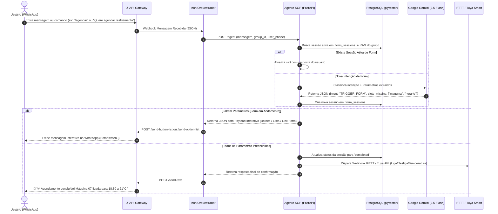

# 📋 Especificação Técnica e Arquitetural: Mapeamento de Comandos com Forms e Integração Z-API (SOF-IA)

---

## 📐 1. Visão Geral e Propósito

Este documento especifica a arquitetura técnica para a implementação de **Comandos Orientados a Formulários (Forms)** no **Agente SOF (SOFIA)**, integrando-os nativamente com o gateway do WhatsApp via **Z-API**, a API backend em **FastAPI**, o orquestrador **n8n** e o banco de dados **PostgreSQL**.

### 🎯 O Problema Atual vs. A Solução com Forms
* **Cenário Atual (Linguagem Natural Livre):** O usuário envia mensagens livres (ex: *"quero agendar o ar-condicionado"*). A SOFIA precisa interpretar texto ambíguo. Se faltarem informações (como horário, máquina ou temperatura), o atendimento pode ficar truncado.
* **Cenário Proposto (Formulários & Interatividade):** A SOFIA detecta a intenção e guia o usuário com **entradas estruturadas** (botões nativos, menus interativos, WhatsApp Flows ou links web dinâmicos), garantindo que todos os parâmetros necessários para acionar os dispositivos IoT (Tuya/IFTTT) sejam validados antes da execução.

---

## 🔄 2. Fluxo End-to-End da Arquitetura (Diagrama Mermaid)



---

## 🎨 3. Três Abordagens de Formulários com Z-API

Existem **3 formas complementares** de apresentar formulários no WhatsApp através da Z-API. Cada uma atende a uma complexidade de caso de uso diferente:

```
┌─────────────────────────────────────────────────────────────────────────────┐
│                          NÍVEIS DE FORMULÁRIOS                              │
├──────────────────────┬──────────────────────────────┬───────────────────────┤
│ Abordagem            │ Interface no WhatsApp        │ Melhor para:          │
├──────────────────────┼──────────────────────────────┼───────────────────────┤
│ 1. Conversacional    │ Botões e Menus de Lista      │ 1 a 3 perguntas       │
│    (Z-API Interactive)│ (Native Quick Replies)       │ rápidas / Seleções    │
├──────────────────────┼──────────────────────────────┼───────────────────────┤
│ 2. WhatsApp Flows    │ Pop-up nativo interno        │ Forms de 3 a 8 campos │
│    (Native Meta Flow)│ (Inputs, Radios, Checkbox)   │ em tela única         │
├──────────────────────┼──────────────────────────────┼───────────────────────┤
│ 3. Form Web Externo  │ Link com Webview Mobile      │ Checklists extensos,  │
│    (Micro App / Web) │ (Assinatura, Foto, Tabelas)  │ relatórios e uploads  │
└──────────────────────┴──────────────────────────────┴───────────────────────┘
```

---

### 🔹 Abordagem 1: Formulário Conversacional (State Machine + Z-API Buttons/Lists)

A SOFIA conduz um questionário passo a passo diretamente na conversa do WhatsApp.

#### Endpoints da Z-API Utilizados:
1. **Botões de Resposta Rápida (`POST /send-button-list`):**
   - Máximo de **3 botões** por mensagem.
   - Ideal para decisões de "Sim/Não", "Confirmar/Cancelar" ou escolha entre poucas máquinas.
   ```json
   {
     "phone": "5511999999999",
     "message": "Selecione a temperatura desejada para a Central do Showroom:",
     "buttonList": {
       "buttons": [
         {"id": "temp_20", "label": "❄️ 20°C (Frio)"},
         {"id": "temp_22", "label": "🍃 22°C (Conforto)"},
         {"id": "temp_24", "label": "🌿 24°C (Econômico)"}
       ]
     }
   }
   ```

2. **Listas Selecionáveis / Menus (`POST /send-option-list`):**
   - Exibe um menu expansível com até **10 opções** organizadas em seções.
   - Ideal para escolha de aparelhos em ambientes com muitas máquinas.
   ```json
   {
     "phone": "5511999999999",
     "message": "Selecione qual equipamento você deseja configurar:",
     "optionList": {
       "title": "Equipamentos Disponíveis",
       "buttonLabel": "Ver Máquinas",
       "options": [
         {
           "title": "Showroom Principal",
           "rowId": "eq_01",
           "description": "Fancoil Daikin 60.000 BTU"
         },
         {
           "title": "Recepção Central",
           "rowId": "eq_07",
           "description": "Split Cassete LG 36.000 BTU"
         }
       ]
     }
   }
   ```

---

### 🔹 Abordagem 2: WhatsApp Flows (Nativo do WhatsApp via Z-API)

O **WhatsApp Flows** permite criar formulários ricos e nativos que abrem diretamente no aplicativo sem redirecionar para um navegador externo.

#### Características:
* Layout nativo em tela inteira no WhatsApp.
* Validação de campos em tempo real (campos obrigatórios, máscaras).
* Retorno em pacote único no webhook da Z-API ao clicar em *Submit*.

#### Payload do Webhook retornado pela Z-API ao submeter o Flow:
```json
{
  "event": "flow_response",
  "phone": "5511999999999",
  "instanceId": "ZAPI_INSTANCE_ID",
  "flowId": "flow_agendamento_climatizacao",
  "response": {
    "equipamento_id": "eq_07",
    "temperatura_alvo": 21,
    "modo": "COOL",
    "horario_inicio": "18:30",
    "desligamento_automatico": true
  }
}
```

---

### 🔹 Abordagem 3: Form Web Externo Dinâmico (Micro Frontend / Webview)

Para casos operacionais avançados (ex: formulário de manutenção preventiva de fancoils com fotos da máquina), a SOFIA envia um link único assinado com JWT ou token temporário.

#### Fluxo de Comunicação:
1. SOFIA envia mensagem via Z-API:
   > *"Por favor, preencha o relatório de manutenção da Máquina 07 clicando no link abaixo:"*
   > `https://sofia.suaempresa.com/forms/manutencao?token=eyJhbGciOi...`
2. O usuário clica e abre o Webform no navegador do celular.
3. Ao finalizar, a página web executa um `POST /api/v1/forms/submit` para o backend FastAPI.
4. O backend valida a submissão, grava os dados e faz uma chamada à Z-API para enviar uma notificação de sucesso no grupo do WhatsApp:
   > *"✅ Relatório de Manutenção #1042 recebido com sucesso por @joao.silva!"*

---

## 🗄️ 4. Modelo de Banco de Dados (PostgreSQL)

Para gerenciar o estado dos formulários e suportar sessões ativas sem perder o contexto, criaremos duas tabelas no schema do PostgreSQL da SOFIA.

```sql
-- =============================================================================
-- 1. TABELA DE TEMPLATES DE FORMULÁRIOS (form_templates)
-- Armazena os formulários disponíveis no sistema e seus schemas de validação
-- =============================================================================
CREATE TABLE IF NOT EXISTS form_templates (
    id VARCHAR(50) PRIMARY KEY, -- ex: 'form_agendamento', 'form_manutencao'
    nome VARCHAR(100) NOT NULL,
    descricao TEXT,
    schema_validacao JSONB NOT NULL, -- Define campos obrigatórios e tipos
    ativo BOOLEAN DEFAULT TRUE,
    created_at TIMESTAMP WITH TIME ZONE DEFAULT NOW()
);

-- =============================================================================
-- 2. TABELA DE SESSÕES DE FORMULÁRIOS (form_sessions)
-- Controla a máquina de estado do formulário ativo por grupo e usuário
-- =============================================================================
CREATE TABLE IF NOT EXISTS form_sessions (
    id UUID PRIMARY KEY DEFAULT gen_random_uuid(),
    group_id VARCHAR(100) NOT NULL,
    user_phone VARCHAR(50) NOT NULL,
    form_template_id VARCHAR(50) NOT NULL REFERENCES form_templates(id),
    current_step VARCHAR(50) NOT NULL, -- ex: 'AguardandoEquipamento', 'AguardandoHorario'
    form_data JSONB DEFAULT '{}'::jsonb, -- Dados acumulados no preenchimento
    status VARCHAR(20) DEFAULT 'in_progress', -- 'in_progress', 'completed', 'expired', 'cancelled'
    expires_at TIMESTAMP WITH TIME ZONE NOT NULL, -- Expiração da sessão (ex: 15 min)
    created_at TIMESTAMP WITH TIME ZONE DEFAULT NOW(),
    updated_at TIMESTAMP WITH TIME ZONE DEFAULT NOW()
);

-- Índices de alta performance para busca rápida durante o webhook
CREATE INDEX IF NOT EXISTS idx_form_sessions_active 
ON form_sessions (group_id, user_phone, status) 
WHERE status = 'in_progress';
```

---

## 📝 5. Schemas Pydantic no Backend (`app/schemas/agent.py`)

Atualização nos contratos de entrada e saída da FastAPI para suportar retornos interativos:

```python
from pydantic import BaseModel, Field
from typing import Optional, List, Dict, Any

class ButtonOption(BaseModel):
    id: str
    label: str

class ListRow(BaseModel):
    row_id: str = Field(..., alias="rowId")
    title: str
    description: Optional[str] = None

class ListOptionGroup(BaseModel):
    title: str
    options: List[ListRow]

class InteractivePayload(BaseModel):
    type: str  # 'button_list' | 'option_list' | 'whatsapp_flow' | 'web_form_link'
    title: str
    description: Optional[str] = None
    buttons: Optional[List[ButtonOption]] = None
    list_options: Optional[List[ListOptionGroup]] = None
    web_url: Optional[str] = None
    flow_id: Optional[str] = None

class AgentResponseExtended(BaseModel):
    group_id: str
    mensagem_resposta: str
    comando_executado: bool
    ifttt_url_triggered: Optional[str] = None
    interactive: Optional[InteractivePayload] = None  # Payload para n8n -> Z-API
    session_id: Optional[str] = None
```

---

## 🧠 6. Estratégia de Engenharia de Prompt (Gemini LLM)

No `llm_service.py`, o modelo **Google Gemini 2.5 Flash** será parametrizado para responder em JSON estruturado identificando quando a requisição exige acionamento de formulário ou continuição de sessão.

### Exemplo de System Instruction Adicional:
```text
Sua função também inclui identificar se a solicitação do usuário exige o preenchimento de um formulário ou parâmetro específico.
Se a solicitação for um agendamento e o usuário NÃO informou a máquina ou o horário, você DEVE retornar a intenção "TRIGGER_FORM" especificando o campo faltante no schema JSON.
```

### Estrutura de Retorno do Gemini:
```json
{
  "intencao": "TRIGGER_FORM",
  "form_id": "form_agendamento",
  "parametros_extraidos": {
    "temperatura": 21
  },
  "parametros_faltantes": ["maquina_id", "horario_inicio"],
  "proxima_pergunta": "Qual equipamento você gostaria de agendar?",
  "tipo_interacao_sugerido": "option_list"
}
```

---

## 🗺️ 7. Roadmap de Implementação por Fases

```
┌─────────────────────────────────────────────────────────────────────────────┐
│                         CRONOGRAMA DE EXECUÇÃO                              │
├─────────┼──────────────────────────────────┼────────────────────────────────┤
│ Fase    │ Escopo                           │ Entregáveis Clave              │
├─────────┼──────────────────────────────────┼────────────────────────────────┤
│ Fase 1  │ Suporte a Botões e Listas Z-API  │ • Atualizar schemas Pydantic   │
│         │ (Interatividade Básica)          │ • Configurar nós do n8n        │
│         │                                  │ • Testar botões no WhatsApp    │
├─────────┼──────────────────────────────────┼────────────────────────────────┤
│ Fase 2  │ Motor de Sessão e Estado (DB)    │ • Criar DDL `form_sessions`    │
│         │ (State Machine)                  │ • Criar `form_service.py`      │
│         │                                  │ • Slot filling no Gemini       │
├─────────┼──────────────────────────────────┼────────────────────────────────┤
│ Fase 3  │ WhatsApp Flows & Web Forms       │ • Integrar WhatsApp Flow ID    │
│         │ (Formulários Avançados)          │ • Criar endpoint web submit    │
└─────────┴──────────────────────────────────┴────────────────────────────────┘
```

### Checklist da Fase 1 (Próximo Passo Prático):
- [ ] Adicionar campos de `interactive` no schema de resposta da FastAPI.
- [ ] Ajustar o nó do n8n para verificar se existe o objeto `interactive` na resposta da API.
- [ ] Se existir `interactive.type == 'button_list'`, o n8n faz chamada para `POST /send-button-list` da Z-API.
- [ ] Se existir `interactive.type == 'option_list'`, o n8n faz chamada para `POST /send-option-list` da Z-API.

---

## 📌 Conclusão

A combinação do **Agente SOF + Z-API** com **Formulários Interativos** proporciona uma experiência de atendimento de classe empresarial no WhatsApp. O sistema ganha previsibilidade, segurança operacional na automação das máquinas Tuya e uma interface moderna e agradável para os usuários dos grupos.
